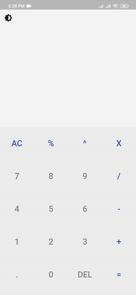

# Calculator App

A simple calculator with basic operators implemented in flutter, with theme a changer.

## Demo 



### Dependencies

External packages used to build this project

```
math_expressions: ^2.0.0
```
```
provider: ^4.3.0
```

### How it Works

This application uses the math_expression package to evaluate the user's mathematical expressions.

The highlight feature is definitely the theme changer implemented completely using Provider. All 

functionalities that include colours is done using the provider package. 

### Design Inspiration

```
https://cdn.dribbble.com/users/2446175/screenshots/5299391/dribbble_calculator_2x.png
```

